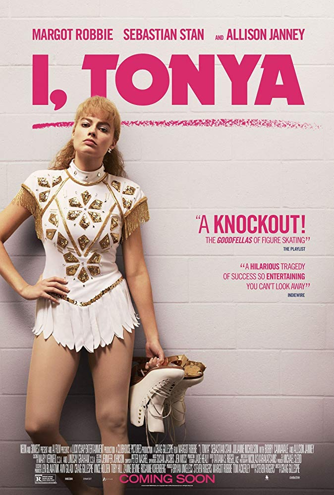

<ul class="tags">
  <li><a href="https://play.google.com/store/movies/details?id=aNwFekmlk5M" target="_blank">Google Play</a></li>
  <li><a href="https://watch.amazon.com/detail?asin=B0789GNMX4" target="_blank">Prime Video</a></li>
  <li><a href="http://www.vudu.com/movies/#!content/925377/I-Tonya" target="_blank">Vudu</a></li>
  <li><a href="https://www.hulu.com/movie/i-tonya-f5636efa-9f93-453c-b3a7-e7b377c004b9?content_id=1276607" target="_blank">Hulu</a></li>
</ul>

  

    <strong>Directed by</strong>
    
Craig Gillespie

  

  

    <strong>Written by</strong>
    
Steven Rogers

  

**Starring**  
Margot Robbie, Sebastian Stan, Julianne Nicholson, Bobby Cannavale, Allison Janney

---

  <figure class="flex-child flex-child-third">
    
  </figure>
  

    Competitive ice skater Tonya Harding rises amongst the ranks at the U.S. Figure Skating Championships, but her future in the activity is thrown into doubt when her ex-husband intervenes.
  

