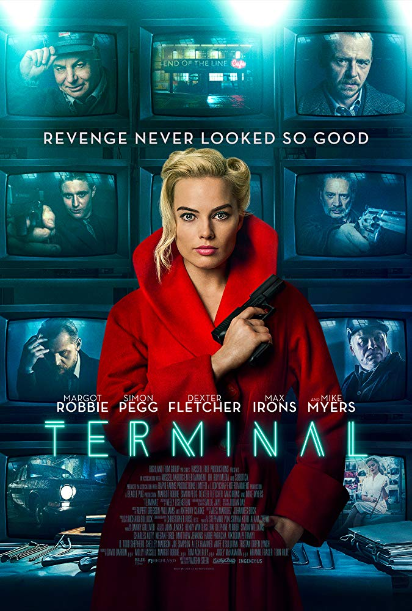

<ul class="tags">
  <li><a href="https://play.google.com/store/movies/details?id=-p44qOlWaXE" target="_blank">Google Play</a></li>
  <li><a href="https://watch.amazon.com/detail?asin=B07CN69KHR" target="_blank">Prime Video</a></li>
  <li><a href="http://www.vudu.com/movies/#!content/945116/Terminal" target="_blank">Vudu</a></li>
  <li><a href="https://www.hulu.com/watch/1316815" target="_blank">Hulu</a></li>
</ul>

  

    <strong>Directed by</strong>
    
Vaughn Stein

  

  

    <strong>Written by</strong>
    
Vaughn Stein

  

**Starring**  
Margot Robbie, Simon Pegg, Mike Myers, Dexter Fletcher, Max Irons

---

  <figure class="flex-child flex-child-third">
    
  </figure>
  

    A film noir taking place in a train terminal at night. Add 2 male assassins, female assassin, waitress, teacher, janitor and crime boss. Add revenge. Who says mystery is a lost art?
  

